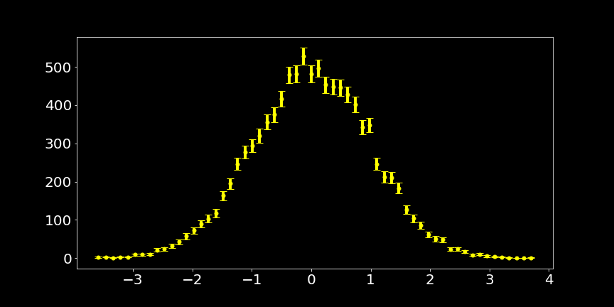
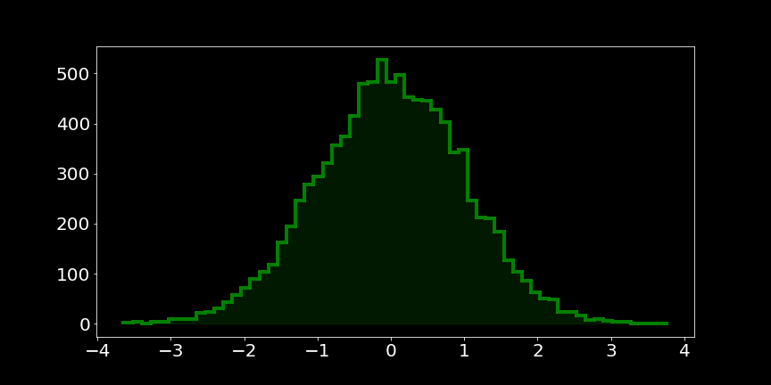
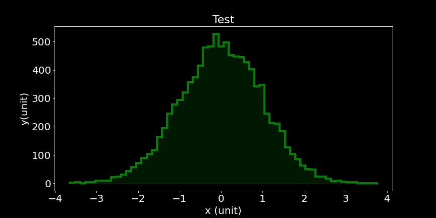
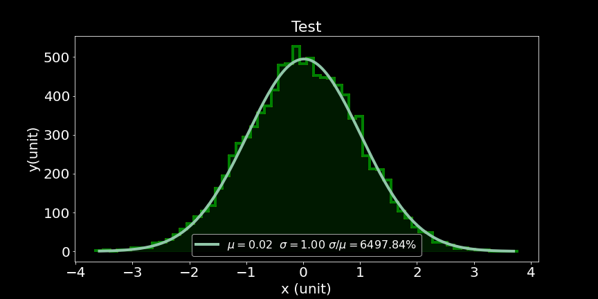
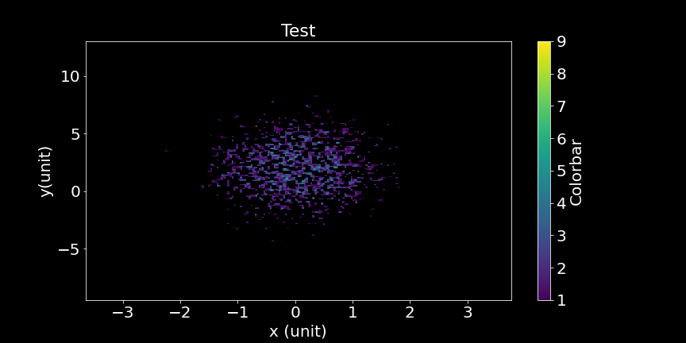

# Easy Histogram
This is a very small python package used to make histograms in python, and optionally plot them with `matplotlib`. The underlying histogramming tool is from `numpy`. This provides a very handy wrappers around them to easily make common histograms in 1d and 2d and plot with nice labels.

# Installation

```bash
$ pip install easyhist
```


# Usage

You can import the library and make histograms and plot them(optionally)


```python
import numpy as np
import matplotlib.pyplot as plt
import easyhist as eh


# initialize data
x = np.random.normal(0,1,10000)
h = eh.Hist1D(x,bins='auto')
```

The returned histogram object has a handy `plot` method which uses `matplotlib` to plot the histogram.

```python
fig,ax = plt.subplots(1,1,figsize=(12,6))

h.plot(ax)
```


The histogram comes by default with error bars. Different keyword parameters can be passed to customise the histogram.

```python
fig,ax= plt.subplots(1,1,figsize=(12,6))
h.plot(ax,steps=True,ebar=False,filled=True)
```




Axes labels and titles can be passed to the plot function.

```python
fig,ax= plt.subplots(1,1,figsize=(12,6))
h.plot(ax,steps=True,ebar=False,filled=True,xlabel='x (unit)',ylabel='y(unit)',title='Test')
```



Many times we have to fit gaussian to the histogram. An easy `fit_normal` method is provided with fits `normal_distribution` to the dateset.

```python
h_fited = h.fit_normal()
```

Since the fitted object is an instance of `Hist1D` we can use the `plot` method as above to plot.

```python
fig,ax= plt.subplots(1,1,figsize=(12,6))
h_fited.plot(ax,steps=True,ebar=False,filled=True,xlabel='x (unit)',ylabel='y(unit)',title='Test')
```



## 2D Histogram
The library naturally has `Hist2D` class for 2D histogram.

```python
y = np.random.normal(2,3,10000)
h2d = eh.Hist2D((x,y),bins=200)
```

We can similarly plot the histogram.

```python
fig,ax= plt.subplots(1,1,figsize=(12,6))
h2d.plot(ax,steps=True,ebar=False,filled=True,xlabel='x (unit)',ylabel='y(unit)',title='Test',cbarlabel='Colorbar',aspect='auto',cmin=1)
```



There are a lot of othe nice useful features which can be found in the documentation.